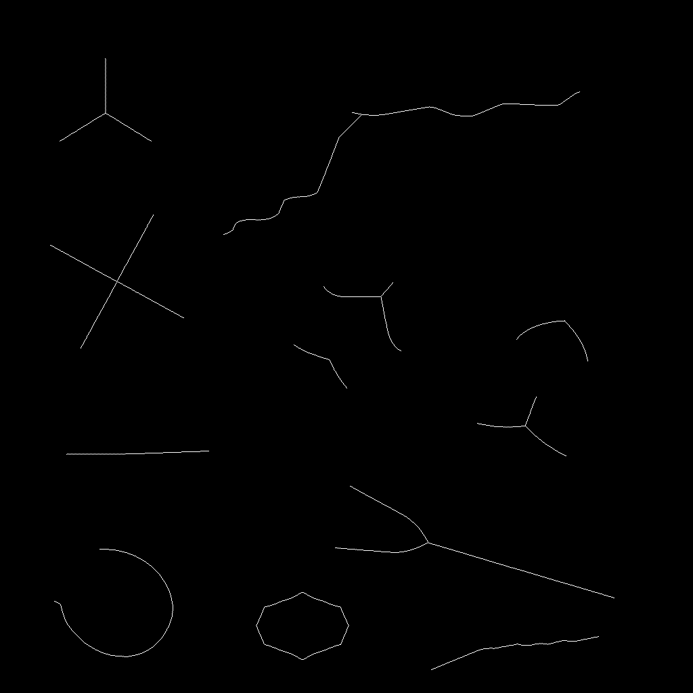

# Ridge Detector

⇒

Detect central inner ridges (medial structures) of arbitrary 2D shapes.

This repository is centered on a JavaScript re-implementation of scikit-image's `medial_axis` method, extended with additional project logic that removes low-radius corner branches.

In short: the pipeline first computes a scikit-style medial ridge, optionally rounds sharp corners, then applies a pruning step to remove branch fans that tend to appear near sharp corners.

The project focuses on extracting stable center-like lines from masks and silhouettes. A primary use case is building footprints in 3D games, where inner ridges can drive roof skeletons, corridor spines, support placement, or stylized architectural detail.

The project is not intended as production-ready software out of the box. It is a strong reference and experimentation base that can be adapted to specific pipelines and constraints.

## Repository Structure

This repo contains two main folders with different goals:

## medial_axis_finding

- Fully documented, research-heavy workflow.
- Combines methods inspired by SciPy/scikit-image morphology and paper-based ridge logic.
- Complex and experimental by design.
- Best for understanding behavior in depth and adapting algorithms safely.

## Ridge_Test

- Minimal, fully functional implementation with tested default settings.
- Includes an interactive HTML visualizer that shows each processing step.
- Best for quick iteration, parameter tuning, and practical output generation.

## Example Use Cases

- Building footprints to roof ridge guides and roof mesh scaffolds.
- Centerline extraction for roads, paths, and rivers from painted map regions.
- AI lane generation inside irregular gameplay zones.
- Procedural dungeon and cave "inner spine" generation.
- Shape-aware anchor lines for VFX placement (cracks, veins, energy conduits).
- Region skeletons for strategy-map territories and influence overlays.

## Quick Start

1. Open `Ridge_Test/index.html` to load sample textures quickly.
2. Open `Ridge_Test/medial_ridge_visualizer.html` for the full step-by-step view.
3. Adjust settings and recompute to inspect behavior.

If your browser blocks local file access, run a lightweight local static server from the repository root, then open the same pages through `http://localhost`.

## Which Folder Should I Use?

- Use `Ridge_Test` when you want results fast and visual debugging.
- Use `medial_axis_finding` when you want traceability, transferability, and algorithm-level customization.

## Notes

- The implementation emphasizes clarity and inspectability over performance tuning.
- Default settings are stable for many shapes, but edge-case behavior should be validated for your specific content.
- The visualizer is intentionally detailed so it can serve both as a reference and as a practical tuning tool.

## References

- In-repo source resources:
  - `medial_axis_finding/resources/_skeletonize.py` (scikit-image reference implementation details)
  - `medial_axis_finding/resources/_skeletonize_cy.pyx` (ordered thinning loop details)
  - `medial_axis_finding/resources/_morphology.py` (SciPy distance transform API behavior)
  - `medial_axis_finding/resources/ni_morphology.c` (SciPy exact Euclidean feature transform implementation)
- scikit-image example page (medial axis and skeletonization): https://scikit-image.org/docs/stable/auto_examples/edges/plot_skeleton.html
- [Lee94] T.-C. Lee, R.L. Kashyap and C.-N. Chu, Building skeleton models via 3-D medial surface/axis thinning algorithms. Computer Vision, Graphics, and Image Processing, 56(6):462-478, 1994.
- [Zha84] A fast parallel algorithm for thinning digital patterns, T. Y. Zhang and C. Y. Suen, Communications of the ACM, March 1984, Volume 27, Number 3.
